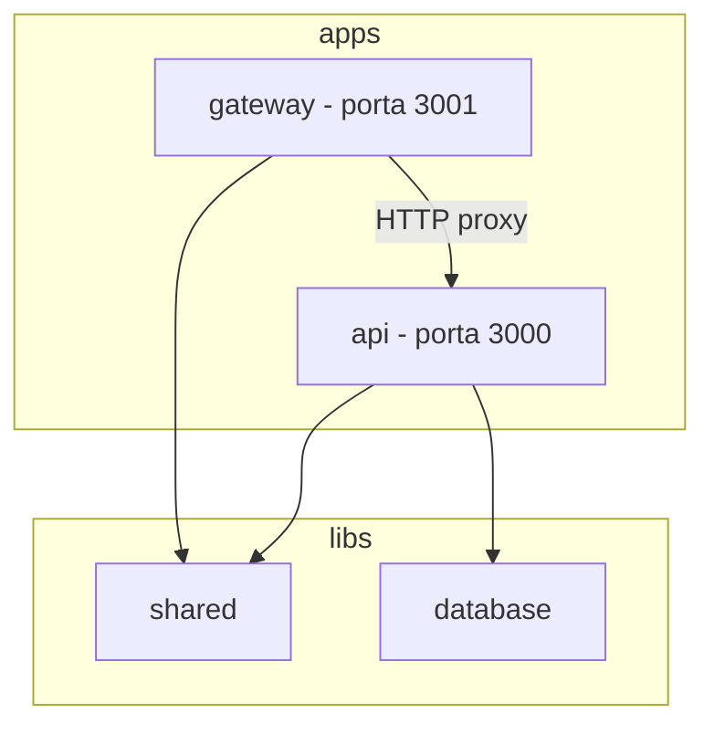

# nest-monorepo-workspace

[](https://nestjs.com/)
[](https://nodejs.org/)
[](LICENSE)

Projeto de **aprendizagem** sobre monorepo no NestJS usando **workspace mode**. O repositório demonstra como estruturar múltiplas aplicações e bibliotecas compartilhadas em um único repositório, seguindo a documentação oficial do Nest CLI.

> Documentação oficial: [Workspaces (monorepo)](https://docs.nestjs.com/cli/monorepo) | [Libraries](https://docs.nestjs.com/cli/libraries)

---

## Sobre o projeto

Este repositório não é um produto pronto para produção. Ele existe para você estudar:

- Diferença entre **standard mode** e **monorepo mode**
- Como organizar **apps** (deployáveis) e **libs** (código reutilizável)
- Como o Nest gerencia paths (`@app/*`), build e default project
- Boas práticas de estrutura em times com múltiplos serviços Nest

### O que está incluído

| Projeto | Tipo | Descrição |
|---------|------|-----------|
| `api` | Application | API REST com endpoint `/users` |
| `gateway` | Application | BFF/proxy que repassa `/users` para a API |
| `shared` | Library | DTOs e utilitários compartilhados |
| `database` | Library | Módulo de dados in-memory (mock para estudo) |



---

## Pré-requisitos

- **Node.js** 20 ou superior (veja [`.nvmrc`](.nvmrc))
- **npm** 10+
- **Nest CLI** (opcional, pode usar `npx`):

```bash
npm install -g @nestjs/cli
# ou use npx @nestjs/cli@latest em cada comando
```

---

## Setup rápido (clone)

```bash
git clone <seu-repo>
cd nest-monorepo-workspace
npm install
cp .env.example .env
```

### Rodar os serviços

**Opção A — dois terminais:**

```bash
# Terminal 1
npm run start:api

# Terminal 2
npm run start:gateway
```

**Opção B — um terminal:**

```bash
npm run start:all
```

### Testar

```bash
# API direta (porta 3000)
curl http://localhost:3000/users

# Gateway proxy (porta 3001)
curl http://localhost:3001/users

# Usuário específico
curl http://localhost:3000/users/1
```

Resposta esperada em `GET /users`:

```json
{
  "data": [
    { "id": "1", "name": "Ana Silva", "email": "ana@example.com" }
  ],
  "meta": { "page": 1, "limit": 10, "total": 3 }
}
```

---

## Setup do zero (reproduzir o monorepo)

Siga esta ordem exata. A conversão para monorepo **só funciona** se o projeto inicial tiver a estrutura canônica (`src/` e `test/` na raiz).

### 1. Criar projeto base (standard mode)

```bash
nest new nest-monorepo-workspace --package-manager npm
cd nest-monorepo-workspace
```

### 2. Converter para monorepo — gerar primeiro app

```bash
nest generate app api
```

O Nest move o código original para `apps/` e define `"monorepo": true` em `nest-cli.json`.

### 3. Segundo app

```bash
nest generate app gateway
```

### 4. Bibliotecas compartilhadas

Ao gerar uma library, o CLI pede um **prefix** (alias de import). Use `@app`:

```bash
nest generate library shared
# prefix: @app

nest generate library database
# prefix: @app
```

> Se o CLI pedir o prefix interativamente e você estiver em CI, use:
> `node node_modules/@angular-devkit/schematics-cli/bin/schematics.js @nestjs/schematics:library --name=shared --prefix=@app`

### 5. Ajustar default project

Edite `nest-cli.json` para que `api` seja o projeto padrão:

```json
{
  "sourceRoot": "apps/api/src",
  "root": "apps/api",
  "compilerOptions": {
    "tsConfigPath": "apps/api/tsconfig.app.json"
  }
}
```

---

## Estrutura do repositório

```
nest-monorepo-workspace/
├── apps/
│   ├── api/                 # Application — API REST (default project)
│   │   ├── src/
│   │   │   ├── main.ts
│   │   │   ├── api.module.ts
│   │   │   └── users/       # Feature que consome @app/database e @app/shared
│   │   └── tsconfig.app.json
│   └── gateway/             # Application — proxy HTTP para a api
│       ├── src/
│       │   ├── main.ts
│       │   └── proxy/
│       └── tsconfig.app.json
├── libs/
│   ├── shared/              # Library — DTOs, interfaces, utils
│   │   ├── src/
│   │   │   ├── dto/
│   │   │   ├── interfaces/
│   │   │   ├── utils/
│   │   │   └── index.ts     # barrel export (entryFile da lib)
│   │   └── tsconfig.lib.json
│   └── database/            # Library — módulo de dados reutilizável
│       ├── src/
│       │   ├── database.module.ts
│       │   ├── database.service.ts
│       │   └── index.ts
│       └── tsconfig.lib.json
├── nest-cli.json            # metadados do workspace
├── package.json             # dependências e scripts centralizados
├── tsconfig.json            # paths @app/* para todas as libs
├── .env.example
└── README.md
```

---

## Conceitos-chave

### Standard mode vs Monorepo mode

| Aspecto | Standard mode | Monorepo mode |
|---------|---------------|---------------|
| Estrutura | Um app na raiz | `apps/` + `libs/` |
| `package.json` | Por projeto | Um na raiz |
| Config (eslint, prettier) | Por projeto | Compartilhada |
| Compiler default | `tsc` | `webpack` |
| Libraries | Manual (npm packages) | Suporte nativo com path aliases |

### Application vs Library

- **Application**: tem `main.ts`, roda standalone, é deployável
- **Library**: exporta via `index.ts`, não roda sozinha, é importada por apps

### Default project

Definido em `nest-cli.json` → `"root"`. Comandos sem nome de projeto usam esse default:

```bash
nest start          # equivale a nest start api
nest build          # equivale a nest build api
```

Para outro app:

```bash
nest start gateway
nest build gateway
```

---

## Imports com path alias

Ao criar uma library com prefix `@app`, o Nest atualiza `tsconfig.json`:

```json
{
  "compilerOptions": {
    "paths": {
      "@app/shared": ["libs/shared/src"],
      "@app/shared/*": ["libs/shared/src/*"],
      "@app/database": ["libs/database/src"],
      "@app/database/*": ["libs/database/src/*"]
    }
  }
}
```

Uso nos apps:

```typescript
import { PaginationDto, createApiResponse } from '@app/shared';
import { DatabaseModule } from '@app/database';
```

O Jest também precisa mapear esses paths — já configurado em `package.json` → `jest.moduleNameMapper`.

---

## Scripts npm

| Script | Descrição |
|--------|-----------|
| `npm run start:api` | API em watch mode (porta 3000) |
| `npm run start:gateway` | Gateway em watch mode (porta 3001) |
| `npm run start:all` | Sobe api + gateway juntos |
| `npm run build:api` | Build apenas da api |
| `npm run build:gateway` | Build apenas do gateway |
| `npm run build:shared` | Build da lib shared |
| `npm run build:database` | Build da lib database |
| `npm run build:all` | Build api + gateway |
| `npm run start:prod:api` | Roda build de produção da api |
| `npm run lint` | ESLint em apps e libs |

---

## Variáveis de ambiente

Copie [`.env.example`](.env.example) para `.env`:

| Variável | Default | Descrição |
|----------|---------|-----------|
| `API_PORT` | `3000` | Porta da api |
| `GATEWAY_PORT` | `3001` | Porta do gateway |
| `API_URL` | `http://localhost:3000` | URL base usada pelo gateway |

---

## Build e deploy

```bash
npm run build:all
```

Output em `dist/apps/<nome>/`. No monorepo, o compiler default é **webpack**, que gera um bundle único por app (inclui dependências das libs).

Alternativas de compiler em `nest-cli.json`:

```json
{
  "compilerOptions": {
    "builder": "tsc"
  }
}
```

Outras opções: `swc` (builds mais rápidos — [doc Nest](https://docs.nestjs.com/cli/overview)).

---

## Boas práticas

### O que colocar em lib vs app

| Coloque em **lib** | Coloque em **app** |
|--------------------|--------------------|
| DTOs, interfaces, utils | Controllers específicos do serviço |
| Módulos reutilizáveis (auth, database) | Bootstrap (`main.ts`) |
| Lógica compartilhada entre apps | Configuração de porta, middlewares locais |

**Regra de ouro:** uma lib **nunca** importa código de um app. Apps importam libs.

### Config compartilhada

Mantenha na raiz:

- `eslint.config.mjs`
- `.prettierrc`
- `tsconfig.json`
- `package.json` (dependências únicas)

Cada app/lib tem apenas seu `tsconfig.app.json` ou `tsconfig.lib.json` estendendo o root.

### Quando usar monorepo

**Use monorepo quando:**

- Time compartilha código entre serviços Nest
- Quer refatorar libs e ver impacto imediato nos apps
- Precisa de testes de integração entre módulos

**Evite monorepo quando:**

- Projetos são totalmente independentes e de times diferentes
- Precisa versionar libs separadamente para consumo externo → prefira npm packages

### Adicionar novos projetos

```bash
# Nova aplicação
nest generate app billing

# Nova biblioteca
nest generate library auth
# prefix sugerido: @app
```

---

## `nest-cli.json` explicado

```json
{
  "monorepo": true,
  "root": "apps/api",
  "sourceRoot": "apps/api/src",
  "compilerOptions": {
    "webpack": true,
    "tsConfigPath": "apps/api/tsconfig.app.json"
  },
  "projects": {
    "api": {
      "type": "application",
      "root": "apps/api",
      "entryFile": "main",
      "sourceRoot": "apps/api/src"
    },
    "shared": {
      "type": "library",
      "root": "libs/shared",
      "entryFile": "index",
      "sourceRoot": "libs/shared/src"
    }
  }
}
```

| Campo | Função |
|-------|--------|
| `monorepo` | Indica workspace mode |
| `root` | Default project (app usado em `nest start` sem argumento) |
| `sourceRoot` | Raiz do código do default project |
| `projects` | Metadados de cada app/lib |
| `type` | `application` ou `library` |
| `entryFile` | `main` (apps) ou `index` (libs) |

---

## Troubleshooting

### Erro de path alias (`Cannot find module '@app/shared'`)

1. Verifique `tsconfig.json` → `paths`
2. Reinicie o TS server no editor
3. Confirme que importa do barrel `index.ts`

### Gateway retorna erro de conexão

A api precisa estar rodando antes do gateway. Use `npm run start:all` ou suba a api primeiro.

### Porta em uso

Altere `API_PORT` ou `GATEWAY_PORT` no `.env`.

### Conversão para monorepo falhou

O projeto original deve ter `src/` e `test/` na raiz **antes** de rodar `nest generate app`. Se a estrutura foi alterada, recrie com `nest new`.

### Build lento

Considere trocar para `builder: "swc"` no `nest-cli.json` (veja doc oficial).

---

## Próximos passos sugeridos

- [ ] Adicionar testes e2e reais para api e gateway
- [ ] Trocar `database` mock por TypeORM ou Prisma
- [ ] Adicionar Docker Compose para subir tudo
- [ ] Configurar CI (GitHub Actions) com `build:all`
- [ ] Experimentar compiler `swc` para builds mais rápidos
- [ ] Criar lib `auth` compartilhada entre apps

---

## Referências

- [NestJS — Workspaces (monorepo)](https://docs.nestjs.com/cli/monorepo)
- [NestJS — Libraries](https://docs.nestjs.com/cli/libraries)
- [NestJS — CLI Overview](https://docs.nestjs.com/cli/overview)
- [Cheatsheet local de comandos CLI](docs/NEST-CLI-CHEATSHEET.md)

---

## Licença

[MIT](LICENSE)
